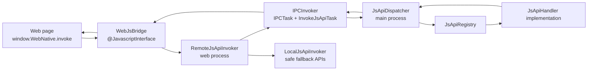

# Android Web Multiprocess Demo

这个 demo 展示一个 Android WebView 多进程容器方案：

- `MainActivity` 运行在主进程，负责启动策略和 JSAPI 目录展示。
- `WebProcessActivity` 运行在 `:web` 子进程，承载 WebView。
- Web 页面通过统一 `NativeBridge.postMessage(json)` 调用 Native。
- `RemoteJsApiInvoker` 使用 IPCInvoker 把 JSAPI 请求转发到主进程。
- `InvokeJsApiTask` 在主进程执行统一派发，不暴露 AIDL 给业务实现方。
- `LocalWebActivity` 是主进程本地降级容器。

## 运行

用 Android Studio 打开 `android-web-multiprocess-demo`，同步 Gradle 后运行 `app`。

工程依赖：

```gradle
implementation "cc.suitalk.android:ipc-invoker:1.3.7"
```

IPCInvoker 1.3.7 没在 Maven Central 路径下可用，本 demo 在 `settings.gradle` 增加了公开 Maven 镜像：

```gradle
maven {
    url "https://verve.jfrog.io/artifactory/verve-gradle-release/"
}
```

## 架构



## 示例 JSAPI

| API | 说明 | 主进程限定 | 可本地降级 |
| --- | --- | --- | --- |
| `runtime.getApiCatalog` | 输出标准化接口目录 | 否 | 是 |
| `device.getInfo` | 设备、App、进程信息 | 否 | 是 |
| `ui.toast` | 展示 Native Toast | 否 | 是 |
| `user.getProfile` | 模拟主进程账号态 | 是 | 否 |
| `storage.set` | 写主进程 SharedPreferences | 是 | 否 |
| `storage.get` | 读主进程 SharedPreferences | 是 | 否 |
| `demo.echo` | 后续接口实现模板 | 否 | 是 |
| `demo.confirmThenEcho` | 主进程业务通过 UICommand 请求 UI 进程弹确认框 | 是 | 否 |

更多实现规范见 [docs/JSAPI_STANDARD.md](docs/JSAPI_STANDARD.md)。
降级策略见 [docs/DEGRADE_STRATEGY.md](docs/DEGRADE_STRATEGY.md)。
UICommand 反向 UI 调用设计见 [docs/UICOMMAND_DESIGN.md](docs/UICOMMAND_DESIGN.md)。

## 关键文件

- `app/src/main/java/com/example/webmultiprocess/DemoApplication.java`: IPCInvoker 初始化。
- `app/src/main/java/com/example/webmultiprocess/ipc`: IPCInvoker Service 和跨进程 Task。
- `app/src/main/java/com/example/webmultiprocess/bridge`: Web JSBridge、远程/本地 Invoker。
- `app/src/main/java/com/example/webmultiprocess/jsapi`: JSAPI 协议、派发器、注册表。
- `app/src/main/java/com/example/webmultiprocess/jsapi/handlers`: 标准化接口示例。
- `app/src/main/java/com/example/webmultiprocess/ui`: UICommand 协议、会话注册、反向 UI 命令分发。
- `app/src/main/assets/web/demo.html`: Web 侧 Promise 调用封装与测试页面。
