# UICommand 设计

UICommand 用来解决一个核心问题：主进程业务 JSAPI 需要触发 UI 动作，但 `Activity`、`Fragment`、`View`、`WebView` 都不能跨进程传递。

结论：

- 跨进程只传 `pageId + command + payload`。
- UI 对象留在 Web/UI 进程，通过 `UiSessionRegistry` 按 `pageId` 查找。
- 主进程只能请求 UI 进程执行命令，不能持有 UI 对象。

## 调用链

```mermaid
flowchart LR
    Web["Web JS"] --> Hybrid["Hybrid.invoke(requestJson)"]
    Hybrid --> Remote["RemoteJsApiInvoker<br/>:web process"]
    Remote --> MainTask["InvokeJsApiTask<br/>main process"]
    MainTask --> Handler["demo.confirmThenEcho<br/>main handler"]
    Handler --> Client["UiCommandClient<br/>build command JSON"]
    Client --> UiTask["InvokeUiCommandTask<br/>:web process"]
    UiTask --> Registry["UiSessionRegistry<br/>pageId lookup"]
    Registry --> Session["WebUiSession<br/>Activity/Fragment holder"]
    Session --> Dialog["AlertDialog"]
    Dialog --> Handler
    Handler --> Web
```



## UICommand 请求

```json
{
  "commandId": "cmd_1710000000000",
  "pageId": "page_1710000000000_abcd",
  "command": "dialog.confirm",
  "sourceApi": "demo.confirmThenEcho",
  "payload": {
    "title": "UICommand from main process",
    "message": "Confirm this action?",
    "positiveText": "Confirm",
    "negativeText": "Cancel"
  },
  "timeoutMs": 6000,
  "timestamp": 1710000000000
}
```

## UICommand 响应

```json
{
  "commandId": "cmd_1710000000000",
  "pageId": "page_1710000000000_abcd",
  "command": "dialog.confirm",
  "success": true,
  "code": "OK",
  "message": "success",
  "data": {
    "confirmed": true,
    "pageId": "page_1710000000000_abcd"
  },
  "process": "com.example.webmultiprocess:web",
  "costMs": 1200,
  "timestamp": 1710000001200
}
```

## Demo 对应代码

- `ui/UiCommandProtocol.java`: UICommand 请求和响应协议。
- `ui/UiCommandConfigs.java`: UICommand 名称、默认文案和超时配置。
- `ui/UiCommandFields.java`: UICommand 请求和响应字段。
- `ui/UiCommandCodes.java`: UICommand 错误码。
- `ui/UiSessionRegistry.java`: 当前进程内的 `pageId -> UiSession` 注册表。
- `ui/WebUiSession.java`: 持有 Activity 弱引用，只在 UI 进程内执行弹窗。
- `ui/UiCommandClient.java`: 主进程同步等待 UICommand 结果。
- `ipc/InvokeUiCommandTask.java`: IPCInvoker 反向调用 Web/UI 进程。
- `handlers/ConfirmThenEchoHandler.java`: 混合 JSAPI 示例。

## 现有 Bridge 迁移原则

老接口里如果直接依赖：

```java
bridge.getActivity()
bridge.getFragment()
bridge.getContext()
```

不要把这个 `bridge` 放进 IPC request。应该按接口能力拆：

| 能力类型 | 迁移方式 |
| --- | --- |
| 纯业务数据 | 主进程 Handler 直接执行 |
| 纯 UI 动作 | 留在 Web/UI 进程 Handler 执行 |
| 主进程业务 + UI 动作 | 主进程 Handler 通过 UICommand 请求 UI 进程 |

`Context` 也要拆清楚：

- 主进程 Handler 只拿 `Application Context`。
- UI 进程 Handler 或 `WebUiSession` 才能拿 `Activity/Fragment`。
- 如果 `pageId` 找不到 UI session，返回 `UI_CONTEXT_UNAVAILABLE`。

## 配置化约束

新增 UICommand 不要在 handler 里裸写命令字符串。先增加配置：

```java
public static final UiCommandConfig DIALOG_CONFIRM = new UiCommandConfig(
        "dialog.confirm",
        6000L,
        "UICommand from main process",
        "The JSAPI handler is running in main process and asks UI process to confirm.",
        "Confirm",
        "Cancel");
```

业务 handler 只引用配置：

```java
UiCommandConfig confirmConfig = UiCommandConfigs.DIALOG_CONFIRM;
UiCommandClient.dispatchSync(
        context.getContext(),
        pageId,
        confirmConfig.command(),
        name(),
        uiPayload,
        confirmConfig.timeoutMs());
```
